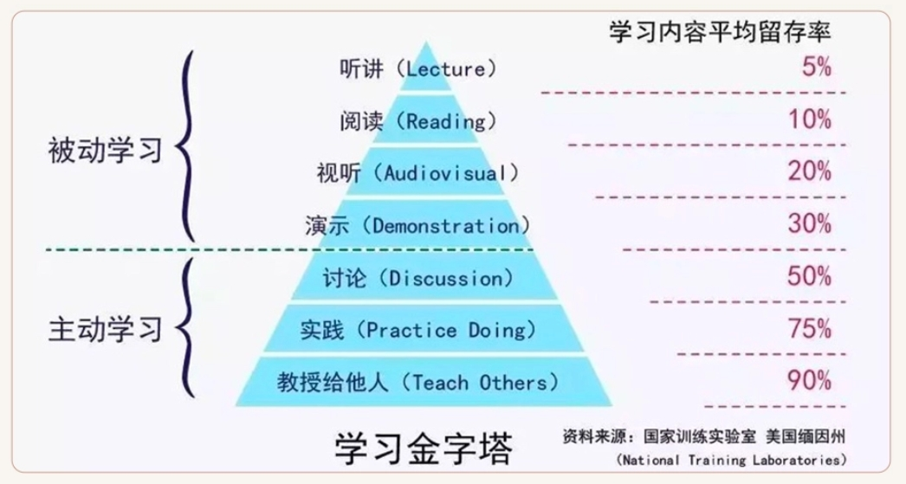

# ARTS 介绍

**ARTS = Algorithm, Review, Tip, Share**

**ARTS**，是`左耳朵耗子`提出来的一个打卡任务，本质是一种**刻意训练**的方式。坚持 `ARTS` 打卡，你就会发现你每天都在进步。

- 算法和技术能力的提升
- 克服懒惰，主动学习
- 坚持做事，不畏惧
- 养成协作和表达习惯

## Algorithm

每周至少做一个 `LeetCode` 算法题。主要是为了编程训练和学习。如果不训练你看再多的算法书，你依然不会做算法题。关于做 `LeetCode` 的优势，可以看一下耗子叔的文章：[LEETCODE 编程训练](https://coolshell.cn/articles/12052.html)

## Review

阅读并点评至少一篇英文技术文档，主要是为了学习英文，如果你的英文不行，你基本无缘技术高手。

## Tip

学习至少一个技术技巧。主要是为了总结和归纳你在日常工作中所遇到的知识点。

## Share

分享一篇有观点和思考的技术文档。主要是为了建立你的影响力，能够输出价值观。

# 结语

引用一张学习金字塔：

`耗子叔`说：在我看来，别人讲、或是自己看书，或是让别人演示给你，都是在被灌输的被动学习，知识留存度最多 `30%`，不能让你真正获得学习能力。**最有效的方法，是通过思辨，践行，总结和归纳，真正输出自己的知识地图。**否则，你只是在机械地重复某件事（记忆知识），而不会有质的成长的。

主动学习，积极完成每周任务。